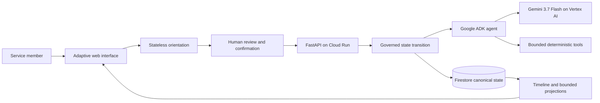

# Military SLICES

**U.S. Military and Coast Guard Career Transition Planning Assistant**

Military SLICES turns incomplete transition context into one persistent, governed plan. It connects career, education, location, and résumé decisions; lets a bounded Gemini agent close machine-resolvable work; and asks the service member only for the next decision that genuinely requires them.

This is a fresh competition implementation created during the All Things Agentic Hackathon submission period. It does not contain Veteran Slice code, routes, schemas, deployments, or data.

## What it proves

- Messy human input becomes reviewable orientation before it becomes state.
- Confirmed facts retain human authority and provenance.
- One shared decision can update several transition areas.
- Typed uncertainty preserves `UNKNOWN`, `PARTIAL`, and `CONFLICTED` instead of manufacturing certainty.
- Google ADK with Gemini 3.7 Flash proposes bounded career hypotheses and uses deterministic tools.
- Firestore persists one canonical state with optimistic concurrency and idempotency.
- Cloud Run hosts the public candidate.
- The next interaction is selected by the highest-value unresolved decision.

## Architecture



The state persists. The decision determines the interface.

## Local setup

Prerequisites: Python 3.11+, a Google Cloud project, and Application Default Credentials for live Gemini/Firestore use.

```bash
python -m venv .venv
source .venv/bin/activate  # Windows: .venv\Scripts\activate
pip install -e ".[dev]"
cp .env.example .env
uvicorn military_slices.app:app --reload --port 8080
```

For a deterministic local run without cloud writes, keep:

```text
MILITARY_SLICES_STORE=memory
MILITARY_SLICES_AGENT=deterministic
```

Open `http://127.0.0.1:8080`.

## Tests

```bash
pytest
ruff check .
mypy military_slices
bandit -r military_slices
pip-audit
```

## Deploy to Cloud Run

```bash
gcloud run deploy military-slices \
  --source . \
  --region us-west1 \
  --allow-unauthenticated \
  --set-env-vars MILITARY_SLICES_ENV=production,MILITARY_SLICES_STORE=firestore,MILITARY_SLICES_COOKIE_SECURE=true,MILITARY_SLICES_AGENT=adk,GOOGLE_GENAI_USE_VERTEXAI=true,GOOGLE_CLOUD_LOCATION=global,MILITARY_SLICES_MODEL=gemini-3.7-flash
```

Set `MILITARY_SLICES_SESSION_SECRET` from Secret Manager in production. Grant the runtime service account Firestore User and Vertex AI User.

## Data and authority boundary

- Unconfirmed orientation is not written.
- Raw uploaded bytes are ephemeral and are never written to Firestore.
- Model output is a proposal, never self-authenticating truth.
- Durable state contains conclusions, provenance, decisions, and minimal feedback—not hidden model reasoning.
- This product provides transition planning, not legal, medical, financial, clearance, benefits, or employment guarantees.

## Competition technology

- Gemini 3.7 Flash through Vertex AI
- Google Agent Development Kit (ADK)
- Cloud Run
- Firestore

See [docs/HACKATHON_COMPLIANCE.md](docs/HACKATHON_COMPLIANCE.md), [docs/ARCHITECTURE.md](docs/ARCHITECTURE.md), and [docs/DEMO_SCRIPT.md](docs/DEMO_SCRIPT.md).

## License

Apache-2.0. Third-party packages retain their respective licenses.

