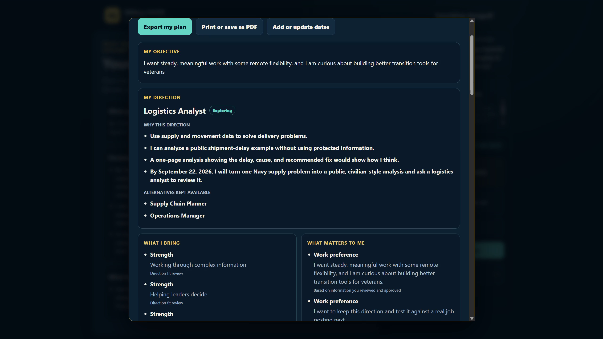
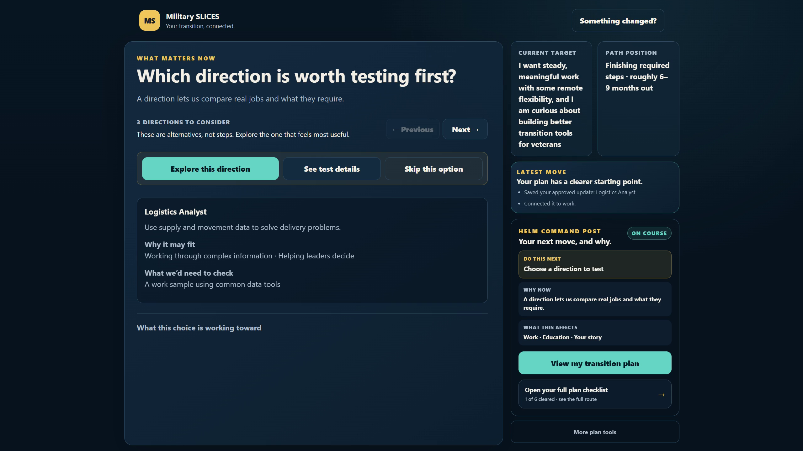

# Military SLICES

**A governed transition-planning partner for service members, veterans, and military families.**

[Try the hosted candidate](https://hackathon-rc---military-slices-ztvqlzospa-uw.a.run.app/) · [Watch the final demo](https://youtu.be/EwAtrtrIUiI) · [Architecture](docs/ARCHITECTURE.md) · [Submission evidence](FINAL_HACKATHON_SUBMISSION_PACKAGE.md)

Military transition is not one decision. Work, education, location, family needs, timing, and personal priorities change together—and most tools either flatten that reality into a checklist or make the person repeat it in every conversation.

Military SLICES starts with ordinary language, a document, or a screenshot. It lets the person review what the system heard before anything changes their plan. From there it keeps one durable transition plan, brings forward only the next decision or real-world action that matters, and reconnects new evidence to the decisions it can actually affect.

The result is not a chat transcript. It is a plan the veteran can inspect, revise, print, and export.



## The experience

A typical journey looks like this:

1. **Start with what you have.** Explain the situation naturally or provide a supported file.
2. **Review before write.** Military SLICES extracts decision-relevant statements and asks the person to correct them before they become plan state.
3. **Work on what matters now.** The interface presents one bounded decision surface, bundling related questions when they belong together.
4. **Use bounded reasoning.** Gemini can propose career directions from a purpose-limited projection; it cannot authorize or persist them.
5. **Keep the human in command.** Consequential choices require an explicit human action. Rejected alternatives remain available without staying in the foreground.
6. **Act outside the app.** The plan turns uncertainty into a small real-world test, such as reviewing a work sample with someone in the field.
7. **Return with evidence.** The result updates only the relevant parts of the plan and may change what comes next.
8. **Take the plan away.** The accumulated direction, strengths, priorities, decisions, experiments, open questions, next actions, and dates are available in a readable export.



## What HELM is

HELM is the governance layer underneath Military SLICES. It separates five jobs that a normal assistant often blends together:

- **Human intent** establishes the objective.
- **Slices** expose the smallest relevant view of the shared plan, such as Career, Education, Location, or Your Story.
- A **Domain Pack** supplies the versioned transition path and the rules that make those views meaningful in this domain.
- A **Gate** identifies the bounded decision that is currently unresolved.
- A **Resolver** may propose an answer from deterministic rules or a bounded Gemini call.
- The **Authority Governor** validates scope, evidence, state version, and authority before any governed change is written.

The model proposes; it does not grant itself authority. Observation does not silently become plan truth. A user can inspect history or explore a hypothetical branch without changing the current plan.

The prototype keeps autonomous HELM Probe execution disabled. Probe is represented in the architecture as a bounded discovery path for relationships that governed structure does not already know; it is not used here as an autonomous decision-maker.

## HELM, Domain Packs, and Slices

HELM is domain-independent governance. The installed Military Transition Domain Pack gives it a versioned service-aware path, stable transition boundaries, and permitted evidence surfaces. Slices are bounded projections over one shared canonical plan—not independent agents and not separate copies of the veteran's data.

That relationship is the core design:

```text
ordinary human input
  → reviewable orientation
  → governed evidence
  → one bounded Slice and Gate
  → deterministic or Gemini/ADK Resolver proposal
  → Authority Governor validation
  → versioned plan state
  → one next decision, action, or re-entry prompt
```


## Technology stack

| Technology | Implemented use |
|---|---|
| **Gemini 3.7 Flash on Vertex AI** | Produces structured, evidence-bounded career hypotheses and natural-language bridges when the current Gate permits a model call. |
| **Google Agent Development Kit (ADK)** | Defines the bounded agent, structured output schema, deterministic tools, call limit, and wall-clock limit around Gemini. |
| **Cloud Run** | Hosts the public FastAPI candidate as a containerized HTTPS service. |
| **Firestore** | Stores one versioned canonical plan per anonymous session with optimistic concurrency, idempotency, and prior-version history. |
| **FastAPI + Pydantic** | Implements the web/API boundary and strict state, proposal, receipt, and export models. |
| **HTML, CSS, and JavaScript** | Delivers the responsive foreground, review surfaces, transition plan, history, What-If, and export experience. |

See [the technology-use ledger](docs/TECHNOLOGY_USE_LEDGER.md) for implementation paths and status.

## Run locally

Prerequisites: Python 3.11 or newer. Google Cloud credentials are needed only for the live ADK/Gemini and Firestore configuration.

```bash
python -m venv .venv
```

Activate the environment:

```bash
# macOS/Linux
source .venv/bin/activate

# Windows PowerShell
.venv\Scripts\Activate.ps1
```

Install and configure:

```bash
pip install -e ".[dev]"
```

Copy `.env.example` to `.env`, then run the deterministic local configuration:

```text
MILITARY_SLICES_STORE=memory
MILITARY_SLICES_AGENT=deterministic
```

```bash
uvicorn military_slices.app:app --reload --port 8080
```

Open <http://127.0.0.1:8080/>.

For live Google services, set `MILITARY_SLICES_STORE=firestore`, `MILITARY_SLICES_AGENT=adk`, a Google Cloud project/location, and Application Default Credentials. Never commit `.env` or credentials.

## Validate

```bash
pytest
ruff check military_slices tests
mypy military_slices
bandit -r military_slices
pip-audit
```

The final executed results, including any environment limitations, are recorded in [the final submission package](FINAL_HACKATHON_SUBMISSION_PACKAGE.md).

## Trust and data boundaries

- Typed orientation is not persisted until the human reviews and approves it.
- Supported files are processed ephemerally; raw bytes and the full extracted artifact are not stored in Firestore.
- Only decision-relevant statements survive governed orientation.
- Resolver output is a typed proposal, never self-authenticating truth.
- Writes are bound to the evaluated state version and protected by optimistic concurrency and idempotency.
- History is read-only; What-If branches are signed, short-lived, and non-canonical until explicitly promoted.
- External operational effects and autonomous Probe execution are disabled in this prototype.
- Military SLICES provides planning support, not legal, medical, benefits, financial, clearance, hiring, or employment advice.

## Prototype scope and limitations

- The reference Domain Pack covers a bounded U.S. military-transition planning journey; it is not an authoritative benefits or eligibility engine.
- Occupational evidence supports exploration and testing, not qualification or hiring predictions.
- The hosted candidate is an anonymous-session prototype, not a production identity system.
- File extraction supports the implemented TXT, DOCX, PDF, scanned-PDF, PNG, and JPEG paths; it is not a general document-management platform.
- Provider failure falls back safely, but fallback career suggestions are intentionally generic outside recognized evidence families.
- Physical-device validation and an independent cold-user study remain outside the completed automated and emulated-mobile evidence.
- The current public candidate is a tagged, zero-production-traffic release candidate. No production traffic was moved for the submission build.

## Hackathon status

Military SLICES is a fresh competition implementation for the **Collaborative Partner** category. The required stack is present: Gemini 3.7 Flash through Vertex AI, Google ADK, and Google Cloud infrastructure (Cloud Run and Firestore). OpenAI Codex assisted with implementation, testing, documentation, and release verification.

The hosted candidate, public presentation video, screenshot pack, claim-to-evidence matrix, and final submission copy are prepared. Synchronizing the final local commit to the public repository, entrant attestations, and the irreversible Devpost submission remain human-controlled steps.

## License

Apache-2.0. Third-party packages retain their respective licenses.
